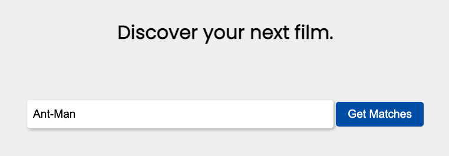
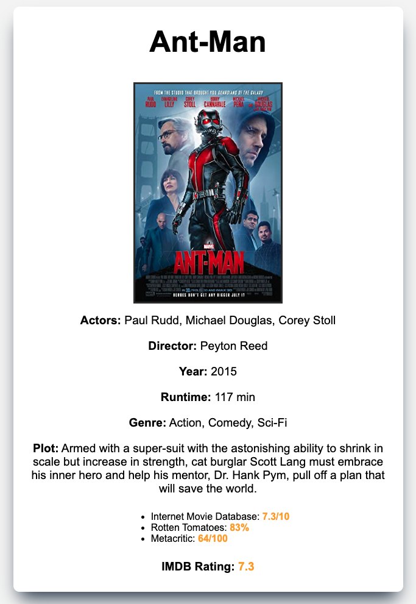
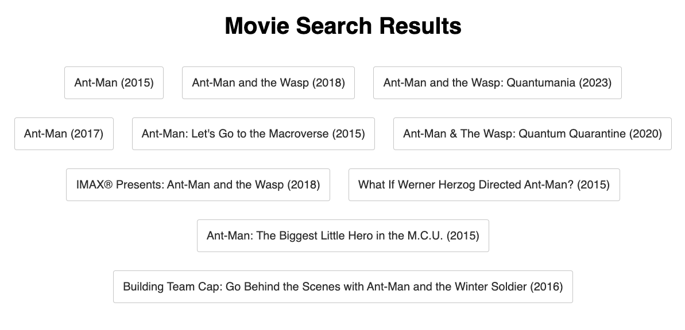

# Movie-Finder
This is an Movie Finding App that I have build for users to find information about the movies they are interested in. 
It is written in Python with Flask framewor and utilizes the OMDB API to query data from. This App can search and match any movies that the user types in and output the similar movies.

## 📄 About
- Download and instructions:
(make sure you have python version 3+ on your system)
$ git clone https://github.com/StevenLikesToCode/Movie-Finder.git Movie_Finder
$ cd Movie_Finder
$ python -m venv venv
$ . venv/bin/activate
$ pip install Flask
$ pip install requests
$ flask --app app run

<!--
-Add in-app screenshots.
## ✏️ Planning & Problem Solving
- Talk about approach to the problem.
- Add screenshots/drawings of doodles/plans during the planning phase.
- Flow charts of app logic.

-->

## 🚀 Cool tech
- OMDB API 
- Python
- Flask 
- HTML
- CSS
<!--
## 😱 Bugs to fix 💩
- Anything a little broken
- Anything a LOT broken
- Buttons to not click to many times (cause its broken 😒)
## 😭 Lessons learnt
What I would do differently if I could wind back the clock...
-->

## ✅ Future features
I would like to add more search functions such as search by genres and publishing year, etc.
